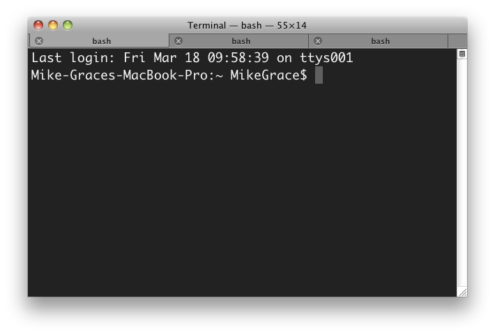

### [***Содержание***](./readmy.md)

### [**< к предыдущей странице**](./download.md)
---
## **3. Терминал**

**Командная строка** или же **терминал** на разных операционных системах открывается по разному. 

- **Ubuntu** 
В операционной системе Ubuntu 20.04 открыть командную строку можно двумя способами: через консоль и через графический терминал.
Для работы через консоль следует нажать сочетание клавиш Ctrl+Alt+F1, для возврата в графический интерфейс — сочетание клавиш Ctrl+Alt+F7.
Для запуска терминала нажмите сочетание клавиш Ctrl+Alt+T

- **Windows** Нажмите Win + R, чтобы открыть окно «Выполнить». Введите «cmd» и нажмите «ОК», чтобы открыть обычную командную строку. Введите «cmd», а затем нажмите Ctrl + Shift + Enter, чтобы открыть командную строку от имени администратора.

- **Mac** Вызовите Spotlight сочетанием Command + Пробел или Option + Command + Пробел. Начните вводить «Терминал» и нажмите Enter. Откройте Finder и перейдите в папку «Программы» → «Утилиты» Найдите «Терминал» и запустите, дважды кликнув по иконке.

---

### [**> к следующей странице**](./firstterm.md)